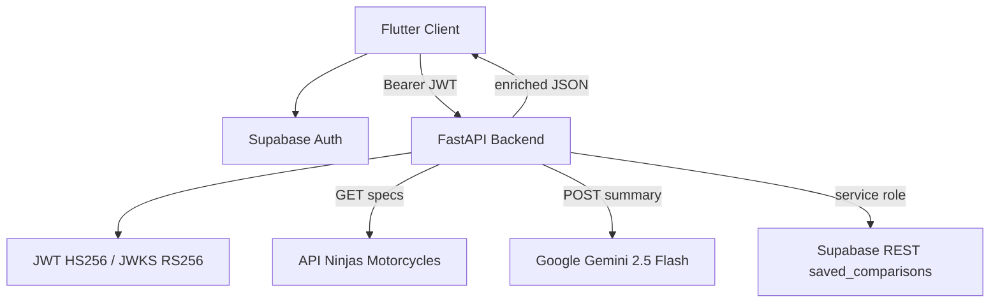

# rev_finder


## About

RevFinder is a motorcycle comparison platform for buyers evaluating two bikes side-by-side. A FastAPI backend aggregates specs from API Ninjas, computes normalized power and comfort scores, and generates plain-English AI verdicts via Gemini for authenticated Supabase users.

## System Architecture



## Key Features & Metrics

- **Server-side spec enrichment** — `motorcycle_service.py` parses 15+ fields (CC, HP, torque, weight, seat height, fuel) with unit conversion (Nm→ft-lb, kg→lb, L→gal) and **15s** upstream timeout.
- **Computed scoring engine** — `MotorcycleSpecs.calcPowerScore()` weights up to **100** points across HP (35), torque (25), CC (20), cylinders (10), power-to-weight (10); comfort score spans 7 dimensions.
- **Per-user AI rate limit** — `/api/comparison/summary` allows **10 calls / 60s** per Supabase `sub`, enforced in-process with sliding window + `threading.Lock`.
- **14 canonical make aliases** — fuzzy make detection scans token spans up to 3 words before querying API Ninjas with fallback model-only search.

## Technical Implementation Notes

- **Dual JWT validation** — supports legacy Supabase **HS256** (`SUPABASE_JWT_SECRET`) and asymmetric **RS256/ES256** via cached `PyJWKClient` against `{SUPABASE_URL}/auth/v1/.well-known/jwks.json`.
- **Strict CORS at boot** — app raises `RuntimeError` if `CORS_ALLOW_ORIGINS` is empty; `allow_credentials=True` requires explicit origin list.
- **Gemini startup gate** — server refuses to start without `GEMINI_API_KEY`; default model `gemini-2.5-flash`, overridable via `GEMINI_MODEL`.
- **Frontend auth gate** — `AuthGate` listens to Supabase session stream; protected POSTs use **120s** timeout for AI responses.
- **Score ownership trade-off** — parsing, unit normalization, and score math live in Python; Flutter renders pre-computed JSON only.

## Local Deployment

Backend (Docker):

```bash
cd backend
# Place .env with MOTORCYCLE_API_KEY, GEMINI_API_KEY, CORS_ALLOW_ORIGINS,
# SUPABASE_URL, SUPABASE_JWT_SECRET, SUPABASE_SERVICE_ROLE_KEY
docker build -t rev_finder_api .
docker run -p 8000:8000 --env-file .env rev_finder_api
```

Frontend:

```bash
cd frontend
flutter pub get
flutter run -d chrome
```

## Project Structure

```
rev_finder/
├── backend/
│   ├── main.py
│   ├── router.py              # JWT auth + motorcycle routes
│   ├── classes.py             # MotorcycleSpecs scoring domain
│   ├── services/motorcycle_service.py
│   ├── routers/
│   │   ├── comparison_router.py  # Gemini summaries
│   │   └── favorites_router.py   # Supabase persistence
│   ├── Dockerfile
│   └── requirements.txt
└── frontend/
    ├── lib/
    │   ├── main.dart          # Dark theme search UI
    │   ├── apiservice.dart    # HTTP + JWT POST helper
    │   ├── comparison.dart    # Spec diff rows
    │   ├── comparison_modal.dart
    │   └── auth_page.dart
    └── pubspec.yaml
```
